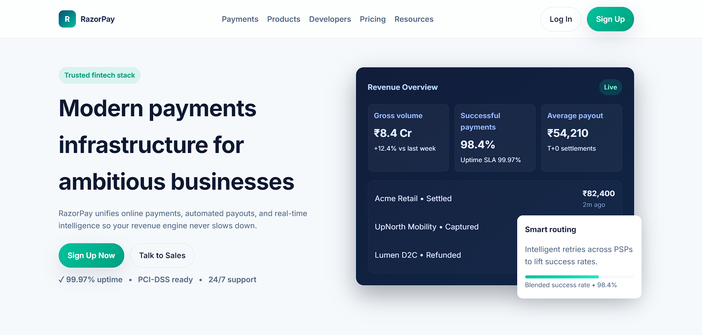

# RazorPay Landing Page

A single-page, RazorPay-inspired fintech landing page built with React and Vite. The design focuses on a clean, modern aesthetic with responsive layouts for mobile, tablet, and desktop.

## Tech Stack
- React (functional components & hooks)
- Vite
- CSS (modular component styles + global theme variables)

## Getting Started
1. Install dependencies:
   ```bash
   npm install
   ```
2. Run the dev server:
   ```bash
   npm run dev
   ```
3. Build for production:
   ```bash
   npm run build
   ```

## Project Structure
```
.
├─ index.html
├─ package.json
├─ vite.config.js
├─ public/
│  └─ favicon.svg
├─ src/
│  ├─ main.jsx
│  ├─ App.jsx
│  ├─ components/
│  │  ├─ Navbar.jsx
│  │  ├─ Hero.jsx
│  │  ├─ Features.jsx
│  │  ├─ ProductHighlights.jsx
│  │  ├─ CtaBand.jsx
│  │  └─ Footer.jsx
│  └─ styles/
│     ├─ global.css
│     ├─ navbar.css
│     ├─ hero.css
│     ├─ features.css
│     ├─ highlights.css
│     ├─ cta.css
│     └─ footer.css
└─ README.md
```

## Responsiveness
- Mobile (≤600px): stacked layout, full-width CTAs, hamburger navigation, hero visual below copy.
- Tablet (601–1024px): two-column hero and product highlights, responsive grids.
- Desktop (≥1025px): full navigation, multi-column grids, side-by-side hero layout.

## Screenshot

